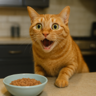
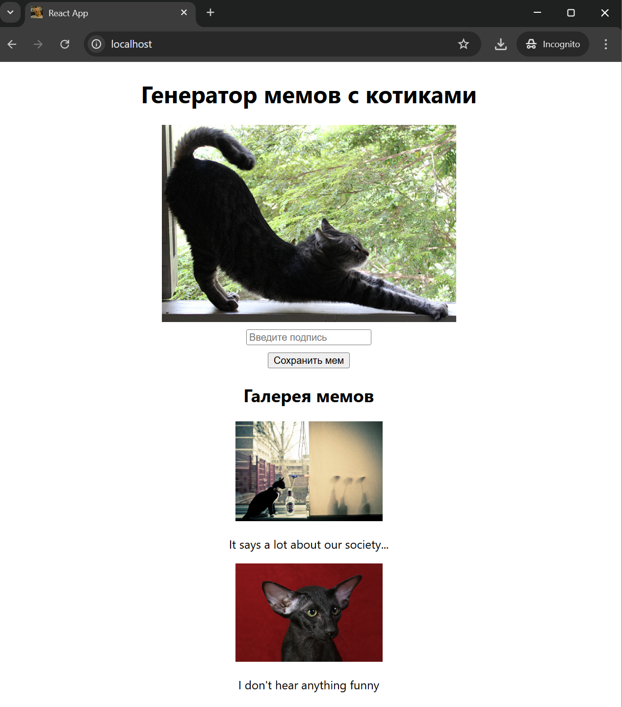

<p align="center">
  
</p>

# 🐱 Cat Meme Generator

A local, dockerized pet project that lets you create cat memes via a Flask backend (Python) with PostgreSQL, and view them through a simple web front‑end.

---

## 📦 Features

- `Flask`‑based REST API for meme creation and retrieval  
- `PostgreSQL` database to store meme metadata (image URL + text)  
- `React`‑based front‑end to view and submit memes  
- All services run in Docker containers via `docker-compose`

---

## 🚀 Prerequisites

- Docker & Docker Compose installed  
- (Optional) `curl` or Postman for API testing

---

## 🛠️ Getting Started

Clone the repo and navigate to its directory:

```bash
git clone https://github.com/saylock/python_project_cats.git
cd python_project_cats
```
### Build and Launch

```bash
docker-compose up --build
```

This will start:

db – PostgreSQL on port `5432`

backend – Flask app on port `5000`

frontend – React dev server on port `80`

### Shutdown

```bash
docker-compose down -v
```

## 🦄 Usage
Go to `localhost:80`  
I will load random image/gif with a cat and you are required to type in funny prompt below it. After you press Save button (or press "Enter") it will be saved into local database and appear in Meme Gallery in the bottom section.
Interface should look like this:  


## Debug

### Prompting database
```bash
 curl http://localhost:5000/api/memes
```
